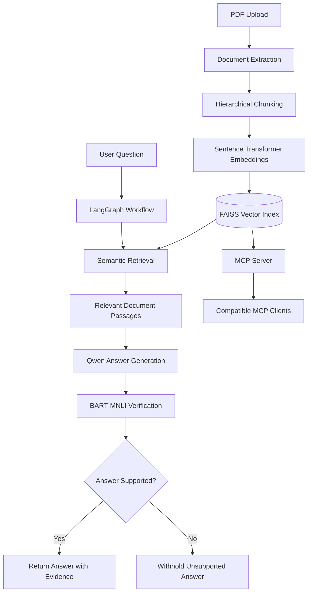
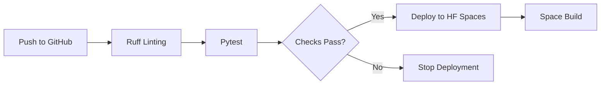

# 🧠 Document Intelligence

### An Agentic RAG System Powered by LangChain, LangGraph & MCP

**Turn complex PDF documents into searchable, conversational knowledge with semantic retrieval, evidence-based answers, automated hallucination checks and an extensible MCP interface.**

[](https://www.python.org/)
[](https://www.langchain.com/)
[](https://www.langchain.com/langgraph)
[](https://huggingface.co/spaces/ssbb2026/AI)
[](https://github.com/ssbb2026/LAng/actions)
[](https://modelcontextprotocol.io/)

**[🚀 Live Demo](https://huggingface.co/spaces/ssbb2026/AI) · [💻 Source Code](https://github.com/ssbb2026/LAng) · [⚙️ CI/CD](https://github.com/ssbb2026/LAng/actions)**

---

## ✨ Overview

Document Intelligence is an end-to-end Retrieval-Augmented Generation (RAG) application designed to transform unstructured PDF documents into an interactive knowledge base.

Unlike a basic PDF chatbot, the system combines semantic search, structured document chunking, workflow orchestration, a Model Context Protocol (MCP) server and an additional natural language inference layer to check whether generated answers are supported by retrieved evidence.

The project demonstrates the integration of modern LLM application development, information retrieval, model evaluation and automated deployment.

## 🚀 Key Features

| Feature                     | Description                                                        |
| --------------------------- | ------------------------------------------------------------------ |
| 📄 PDF Intelligence         | Extracts document content and preserves hierarchical context       |
| 🔍 Semantic Search          | Retrieves relevant passages using Sentence Transformers and FAISS  |
| 🤖 Context-Aware Q&A        | Generates responses using Qwen and retrieved document evidence     |
| 🔗 LangChain                | Provides reusable components for the RAG pipeline                  |
| 🕸️ LangGraph               | Orchestrates retrieval, generation and answer verification         |
| 🛡️ Hallucination Detection | Uses a natural language inference model to check answer support    |
| 🔌 MCP Integration          | Exposes document-retrieval functionality to compatible MCP clients |
| 📊 Retrieval Evaluation     | Measures Hit@K, Precision@K, Recall@K and MRR                      |
| ⚙️ CI/CD                    | Runs automated linting, tests and Hugging Face deployment          |
| 🌐 Interactive UI           | Provides PDF upload and conversational interaction through Gradio  |

## 🏗️ System Architecture



The system has two main stages: document ingestion and question answering. Documents are processed into embeddings and indexed with FAISS. User queries trigger a LangGraph workflow that retrieves evidence, generates an answer and checks whether the answer is supported by the retrieved passages.

## 🛠️ Technology Stack

| Layer                   | Technology               |
| ----------------------- | ------------------------ |
| Programming             | Python                   |
| LLM                     | Qwen 2.5                 |
| Embeddings              | Sentence Transformers    |
| Vector Database         | FAISS                    |
| RAG Framework           | LangChain                |
| Workflow Orchestration  | LangGraph                |
| Hallucination Detection | Facebook BART Large MNLI |
| Document Processing     | PyMuPDF4LLM              |
| Integration             | Model Context Protocol   |
| Frontend                | Gradio                   |
| Deployment              | Hugging Face Spaces      |
| CI/CD                   | GitHub Actions           |
| Testing                 | Pytest and Ruff          |

## 🔍 How It Works

### 1. Document ingestion

Uploaded PDFs are converted into Markdown using PyMuPDF4LLM. Hierarchical chunking preserves document structure, including chapter, section and subsection information.

Each chunk retains source metadata so retrieved information can be traced back to its document.

### 2. Semantic retrieval

Document chunks are embedded using `all-MiniLM-L6-v2` and stored in a FAISS vector index.

When a user submits a question, the system performs similarity-based retrieval to identify relevant passages rather than relying on keyword matching alone.

The index is persisted in `data/faiss_index` and can be reused across application sessions when persistent storage is available.

### 3. Answer generation

Retrieved passages provide context to `Qwen/Qwen2.5-0.5B-Instruct`, which generates an answer based on the available document evidence.

The model is relatively small, making it suitable for experimentation, although CPU-based generation may be slow.

### 4. Hallucination detection

The LangGraph workflow includes a verification stage powered by `facebook/bart-large-mnli`.

Generated answer sentences are checked for entailment against their cited passages, or against the retrieved passages when citations are unavailable.

If the verification stage identifies an unsupported claim, the application withholds the answer instead of presenting it as verified.

**Important:** Natural language inference provides an additional grounding check, not a guarantee of factual correctness. The system cannot establish whether the source document itself is accurate.

## 🔌 Model Context Protocol Integration

Document Intelligence includes an MCP server that makes its document-retrieval functionality available to compatible AI clients.

Start the server:

```bash
python mcp_server.py
```

Example MCP client configuration:

```json
{
  "mcpServers": {
    "document-intelligence": {
      "command": "python",
      "args": [
        "/ABSOLUTE/PATH/TO/mcp_server.py"
      ]
    }
  }
}
```

The server uses standard input/output (stdio). When the MCP server and Gradio application share the same filesystem, they can reuse the persisted FAISS index.

The hosted Gradio application does not automatically expose a remote MCP endpoint. Remote access requires a separately deployed and secured MCP server.

## 💻 Getting Started

### Prerequisites

* Python 3.11
* Git
* Sufficient disk space for downloaded models
* Internet access for initial model downloads

### Installation

Clone the repository:

```bash
git clone https://github.com/ssbb2026/LAng.git
cd LAng
```

Create and activate a virtual environment:

```bash
python -m venv .venv
```

Windows:

```powershell
.venv\Scripts\activate
```

macOS/Linux:

```bash
source .venv/bin/activate
```

Install the dependencies:

```bash
pip install -r requirements.txt
```

Launch the application:

```bash
python app.py
```

Open the Gradio interface, upload a PDF and begin asking questions.

The embedding model downloads on first use, and Qwen downloads when an answer is first generated. The hallucination detector also downloads its NLI model when first needed.

## 📊 Model Evaluation

The project includes retrieval evaluation using manually verified document passages.

| Metric      | What It Measures                                        |
| ----------- | ------------------------------------------------------- |
| Hit@K       | Whether a relevant passage appears in the top K results |
| Precision@K | Proportion of retrieved passages that are relevant      |
| Recall@K    | Proportion of relevant passages retrieved               |
| MRR         | How highly the first relevant passage is ranked         |

To run evaluation, index a PDF and copy `evaluation_data.example.json` to `evaluation_data.json`.

Replace the example chunk identifiers with manually verified relevance labels and execute:

```bash
python evaluation.py
```

Chunk IDs are namespaced by the stored PDF filename.

Evaluation results depend on the document, test questions and quality of the relevance labels. No benchmark scores are claimed without measured results.

## ⚙️ Automated CI/CD Pipeline

The repository uses GitHub Actions to automate code quality checks, testing and deployment.



Run checks locally:

```bash
pip install -r requirements-dev.txt
ruff check --select E4,E7,E9,F .
python -m pytest -q
```

To enable deployment, configure the GitHub Actions repository secret `HF_TOKEN` with write access to the Hugging Face Space.

The deployment workflow runs when changes are pushed to the `main` branch.

## 🔐 Configuration

The following environment variables control the hallucination detector:

| Variable               | Purpose                                                       |
| ---------------------- | ------------------------------------------------------------- |
| `NLI_MODEL`            | Selects the natural language inference model                  |
| `ENTAILMENT_THRESHOLD` | Sets the minimum entailment score required for answer support |

The NLI model requires additional memory and processing time. Test the complete pipeline on your target deployment hardware before enabling it for production workloads.

Never commit API tokens, private documents or other sensitive information to the repository.

## ☁️ Deployment

The application is designed for Hugging Face Spaces with Gradio.

**[Launch the Live Application](https://huggingface.co/spaces/ssbb2026/AI)**

For reliable deployment, keep the Gradio SDK version in the Space's README metadata aligned with the dependencies in `requirements.txt`.

Hugging Face Spaces may use ephemeral storage. Production deployments should use persistent storage for the FAISS index and uploaded documents.

## 📁 Project Structure

```text
LAng/
│
├── app.py
├── rag_engine.py
├── rag_graph.py
├── hallucination_detector.py
├── mcp_server.py
├── evaluation.py
├── evaluation_data.example.json
│
├── requirements.txt
├── requirements-dev.txt
├── pytest.ini
├── README.md
│
├── tests/
│
├── data/
│   └── faiss_index/
│
└── .github/
    └── workflows/
        └── deploy.yml
```

## 🔮 Future Enhancements

* Hybrid retrieval combining semantic and keyword search
* Reranking retrieved passages with cross-encoders
* Multi-document retrieval and comparative question answering
* Improved citation-level faithfulness evaluation
* A secured remote MCP endpoint
* Containerized deployment and persistent vector storage
* Performance and latency benchmarking
* Monitoring for retrieval quality and model drift

## ⚠️ Limitations

The current implementation is an experimental document intelligence system, not a production-grade fact-verification service.

Generated answers can contain errors, retrieval can miss relevant passages, and NLI scores are not calibrated guarantees of truth. The hallucination detector checks consistency with retrieved evidence but cannot validate the underlying document.

Large models and document collections may exceed the memory or compute resources of free hosting environments.

## 👨‍💻 Project Links

**GitHub Repository:** https://github.com/ssbb2026/AI-Document-Intelligence-LangChain-LangGraph-MCP

**Live Application:**  https://huggingface.co/spaces/ssbb2026/Intelligence

---

**Built with Python, LangChain, LangGraph, FAISS, Qwen and MCP — exploring the intersection of information retrieval, agentic AI and reliable document question answering.**

